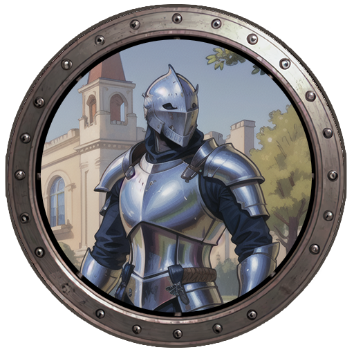

<p align="center">
  
</p>

<h1 align="center">LEGION</h1>
<p align="center"><em>Local AI Agent Platform</em></p>

<p align="center">
  
  
  
  
  
  
</p>

<br/>

**Legion** is a local platform for building and managing AI agent teams.  
One command starts a web UI where you assemble agents, define pipelines, manage tasks and memories — all backed by SQLite, all running on your machine.

---

## Legion is right for you if

✅ You manage **multiple AI agents** across different projects and want one control plane

✅ You mix providers — **Claude, GPT, Gemini, Mistral, Ollama** — and hate configuring each tool separately

✅ You have a **Claude Max subscription** and don't want to burn API credits on orchestration work

✅ You want **AI to analyze your codebase** and recommend which agents to add — not guess manually

✅ You believe agents should have **explicit trigger chains**: who runs next, under what condition, in what order

✅ You want agent **memory to live in plain markdown files** that your coding tools already read

✅ You want something that starts in **one command** with nothing to install

---

## Start Legion in one command

```bash
git clone https://github.com/your-org/legion.git
cd legion
npm start
```

Opens `http://localhost:3000`. No `npm install`. No build step. No Docker.

```bash
npm run dev    # skip auto-opening the browser
```

---

## What Legion manages

| Concept | What it is |
|---------|------------|
| **Project** | A folder on disk with a `.legion/` directory inside |
| **Agent** | An AI persona with a model, identity, memory, tasks, and channels |
| **Pipeline** | A trigger chain — which agent fires after another, and under what condition |
| **Catalog** | 174+ ready-to-use agent definitions across 14 domains |
| **Provider** | An AI backend — Anthropic, OpenAI, Google, Mistral, Ollama, or Claude CLI |
| **Analyze** | AI-powered scan of your project that recommends which agents to add |

---

## Six providers, one interface

| Provider | Auth | Notes |
|----------|------|-------|
| **Anthropic** | API key | Claude 3.5, 3.7, 4.x |
| **OpenAI** | API key | GPT-4o, o3, o4-mini |
| **Google** | API key | Gemini 2.x |
| **Mistral** | API key | Mistral Large / Medium |
| **Ollama** | None | Fully local, no internet required |
| **Claude CLI** | Max subscription | Uses your local `claude` binary — no API billing |

> Using a Claude Max subscription? Select **Claude CLI** as your provider. Legion pipes prompts through your existing `claude` session — no API credits consumed.

---

## Analyze: let AI build your agent team

Point Legion at any project. It reads your docs, scans your existing agents, and sends everything to your default model with the full catalog attached.

```
✦ Analyzing…
  Validating configuration…
  Scanning project documentation… 4 files found
  Loading agent catalog… 174 agents across 14 groups
  Sending prompt to Claude Sonnet 4.6…
  Done — 13 agents recommended, 9 pipelines suggested
```

Recommendations arrive as a live stream — with a **Stop** button if you want to cancel mid-run.

Mandatory agents adapt to context. A game project gets PM + Architect + QA. A personal assistant project gets only what its domain actually needs.

---

## Pipelines: define what triggers what

Every agent can have outgoing trigger rules. After a task completes, Legion knows who to notify next.

```
Product Manager ──[on_success]──▶ Software Architect
                                        │
                           ┌────────────┼────────────┐
                    [parallel]     [parallel]    [parallel]
                           ▼            ▼            ▼
                     iOS Developer  Android Dev  Backend Dev
                                                     │
                                              [on_success]
                                                     ▼
                                               QA Engineer
```

Each connection carries a condition (`always` / `on_success` / `on_failure`) and a mode (`sequential` / `parallel`).

---

## What each agent stores

Every agent in a project gets its own directory:

```
<your-project>/
└── .legion/
    └── agents/
        └── senior-developer/
            ├── AGENTS.md      ← instructions for AI coding tools (Claude Code, Cursor…)
            ├── IDENTITY.md    ← persona and character
            ├── SOUL.md        ← values and principles
            ├── USER.md        ← project and user context
            └── MEMORY.md      ← long-term memories (synced bidirectionally with the UI)
```

`AGENTS.md` and `MEMORY.md` are plain markdown — Claude Code, Cursor, and any AI coding tool reads them directly. Legion is the management layer.

---

## Agent detail — 9 tabs

| Tab | What it does |
|-----|-------------|
| **Overview** | Description, capabilities, identity summary |
| **Chat** | Real AI chat — agent introduces itself on open using its configured model |
| **Workers** | Persistent background processes with live status indicators |
| **Memories** | Persistent / Temporary / Todo memory, synced to `MEMORY.md` on disk |
| **Tasks** | Kanban board — Backlog → In Progress → Ready → Done |
| **Skills** | Assign skills, AI-powered suggestions, `~/.claude/skills` browser |
| **Channels** | HTTP · Webhook · MCP |
| **Cron** | Scheduled jobs with cron expressions |
| **Config** | Model selection, Claude Code activation, markdown file editors |

---

## 174+ agents across 14 domains

Legion ships with the full [agency-agents](https://github.com/msitarzewski/agency-agents) catalog:

| Domain | Example agents |
|--------|---------------|
| Engineering | Senior Developer, Software Architect, DevOps Automator, Security Engineer |
| Game Development | Game Designer, Level Designer, Narrative Designer, Technical Artist |
| Project Management | Product Manager, Senior Project Manager |
| Testing | QA Engineer, Performance Benchmarker |
| Design | UI/UX Designer, Brand Strategist |
| Marketing | Content Strategist, SEO Specialist, Social Media Manager |
| + 8 more | Finance, Sales, Support, Academic, and specialized roles |

---

## Architecture

```
legion/
├── bin/
│   ├── legion.js          ← CLI entry point — argument parsing only
│   └── server.js          ← HTTP server setup, route registration, static serving
├── lib/
│   ├── catalog.js         ← Markdown catalog builder
│   ├── http.js            ← postJson, getJson, json(), readBody()
│   ├── db.js              ← SQLite layer (projects, agents, stores, events — node:sqlite)
│   ├── io.js              ← thin facade over db; API keys managed as gitignored files
│   ├── ws.js              ← zero-dep WebSocket server (RFC 6455 handshake via crypto)
│   ├── agents-fs.js       ← agent file system operations
│   ├── ai.js              ← AI provider abstraction (all 6 providers)
│   └── visor.js           ← Visor bulletin checks
├── routes/
│   ├── projects.js        ← /api/projects
│   ├── agents.js          ← /api/projects/:pid/agents
│   ├── chat.js            ← /api/.../chat, /api/.../chat/intro, /api/proxy/v1/messages
│   ├── skills.js          ← /api/.../skills, suggest-skills
│   ├── config.js          ← /api/models, /api/providers, /api/config
│   ├── analysis.js        ← /api/projects/:pid/analyze (SSE)
│   ├── linear.js          ← /api/projects/:pid/linear/*
│   └── monitoring.js      ← /api/projects/:pid/visor, tasks, pipelines
├── core/
│   ├── agents/catalog/    ← 174+ agent .md files with YAML frontmatter
├── .config/               ← all user data, fully gitignored — delete to reset
│   ├── legion.db          ← SQLite database (projects, agents, tasks, memories…)
│   ├── .pkeys.json        ← provider API keys
│   └── .keys.json         ← model API keys
│   └── prompts/           ← AI analysis prompts — edit to change recommendation logic
└── platforms/web/
    ├── index.html
    ├── js/
    │   ├── app.js         ← bootstrap & event listeners
    │   ├── i18n.js        ← EN / RU localization
    │   ├── modules/       ← state, utils, api
    │   ├── ui/            ← topbar, sidebar, dashboard, agent-panel, catalog, analyze
    │   ├── tabs/          ← one file per agent tab (chat, tasks, memories…)
    │   └── modals/        ← project, decompose, mini modals
    └── css/
        ├── base.css / layout.css / sidebar.css
        ├── dashboard.css / agent-panel.css
        ├── modals.css / settings.css
        ├── analyze.css / tasks-view.css
        └── app.css        ← kept for reference; index.html loads component files
```

No framework. No bundler. No runtime dependencies. Node.js stdlib only.

Keys are stored in `core/config/.pkeys.json` and `core/config/.keys.json` — both gitignored, never leave your machine.

---

## Roadmap

| Feature | Status |
|---------|--------|
| Web portal + file-based storage | ✅ Done |
| 174+ agent catalog | ✅ Done |
| 6 AI providers incl. Claude CLI | ✅ Done |
| AI-powered Analyze with SSE streaming | ✅ Done |
| Agent pipelines | ✅ Done |
| Bidirectional memory sync | ✅ Done |
| EN / RU localization | ✅ Done |
| Real AI chat with per-agent model routing | ✅ Done |
| Ollama proxy for Claude Code (`/api/proxy/v1/messages`) | ✅ Done |
| Modular server architecture (lib/ + routes/) | ✅ Done |
| Skills tab (assign, AI suggest, `~/.claude/skills`) | ✅ Done |
| SQLite persistence layer | ✅ Done |
| Real-time WebSocket activity feed | ✅ Done |

---

## License

MIT
